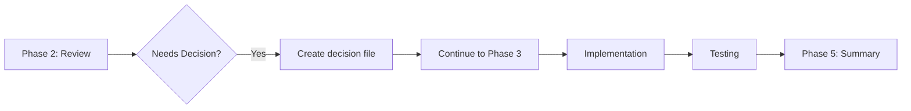
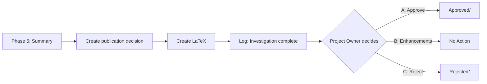
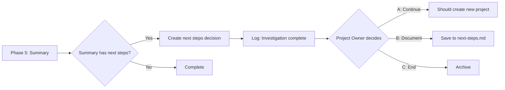

# PENTeam Decision Workflow Analysis

**Date**: 2026-06-15  
**Status**: Complete Analysis  
**Repository**: MathTeam

---

## Executive Summary

This document analyzes the decision workflow in the PENTeam mathematical research team system. The decision loop is a critical component that allows human Project Owners to approve/reject/escalate key decisions during the automated research pipeline.

**Key Finding**: The decision workflow has a critical gap - decisions are created asynchronously but **do not trigger pipeline resumption** after being resolved. The loop is **open-ended** rather than **closed-loop**.

---

## Decision Workflow Overview

### Current Architecture

```
┌─────────────────────────────────────────────────────────────────────┐
│                    SUPERVISOR PIPELINE                              │
├─────────────────────────────────────────────────────────────────────┤
│  1. Input → Process Project → Create Structure                       │
│  2. Creative Mathematician → Propose Theorems                       │
│  3. Senior Mathematician → Review Theorems (with feedback loop)    │
│  4. Python Coder → Implement Code                                    │
│  5. Tester → Validate (with fix loop)                               │
│  6. Senior Mathematician → Validate Results                         │
│  7. LaTeX → Compile Publication                                      │
│  8. Summary → Generate Report                                       │
└─────────────────────────────────────────────────────────────────────┘
                              │
                              ▼ (non-blocking)
┌─────────────────────────────────────────────────────────────────────┐
│                    DECISION CREATION POINTS                         │
├─────────────────────────────────────────────────────────────────────┤
│                                                                     │
│  DECISION POINT 1: Computation Challenge (Phase 2.5)                 │
│  ─────────────────────────────────────────────                      │
│  - Trigger: Theorems mathematically sound but computationally       │
│             infeasible                                              │
│  - File: decisions/pending/{project}/decision-001.md                │
│  - Type: computation                                                │
│  - Options: A) Skip | B) Approximate | C) Theoretical Reference     │
│                                                                     │
│  DECISION POINT 2: Publication Review (Phase 5.5)                   │
│  ─────────────────────────────────────────────                      │
│  - Trigger: Investigation complete, LaTeX compiled                  │
│  - File: decisions/pending/{project}/decision-002.md                │
│  - Type: publication                                                │
│  - Options: A) Approve | B) Request Enhancements | C) Reject         │
│                                                                     │
│  DECISION POINT 3: Next Steps (Phase 5.5)                          │
│  ─────────────────────────────────────────────                      │
│  - Trigger: Summary contains "next step" keywords                  │
│  - File: decisions/pending/{project}/decision-003.md                │
│  - Type: next_steps                                                 │
│  - Options: A) Continue | B) Document Future | C) End               │
│                                                                     │
└─────────────────────────────────────────────────────────────────────┘
                              │
                              ▼ (asynchronous)
┌─────────────────────────────────────────────────────────────────────┐
│                    PROJECT OWNER ACTION                             │
├─────────────────────────────────────────────────────────────────────┤
│                                                                     │
│  Run: docker exec pent-eam-math-team /app/docker/decide.sh          │
│                                                                     │
│  Process:                                                            │
│  1. List pending decisions                                         │
│  2. Select decision by project                                     │
│  3. Review content                                                  │
│  4. Choose option (A/B/C)                                           │
│  5. Enter name, notes, free-form prompt                            │
│  6. Decision appended to file                                       │
│  7. File moved to: decisions/approved/{project}/                   │
│                                                                     │
└─────────────────────────────────────────────────────────────────────┘
                              │
                              ▼ (EXPECTED - but MISSING)
                    ┌─────────────────────┐
                    │  PIPELINE RESUMES   │
                    │  (LOOP CLOSES)      │
                    └─────────────────────┘
                              │
                              ▼ (NEVER HAPPENS)
                    ┌─────────────────────┐
                    │  NEXT PHASE BEGINS  │
                    └─────────────────────┘
```

---

## Critical Issue: Open-Loop Design

### The Problem

The decision workflow is **non-blocking** in the supervisor.sh:

```bash
# supervisor.sh lines ~580-590
if [ "$needs_decision" = "true" ]; then
    log_warn "PROJECT OWNER ACTION REQUIRED..."
    # Non-blocking: continue processing
    log_info "Continuing with next phases..."
fi
```

**Consequence**: After creating a decision file, the pipeline continues immediately to the next phases (Implementation, Testing, etc.) **without waiting for the Project Owner's decision**.

### Why This Is Problematic

1. **Decisions Are Ignored**: The computational decision (skip/approximate/reference) is created but the pipeline proceeds with the original implementation anyway.

2. **Publication Decision Has No Effect**: The publication review decision is created, but no mechanism exists to:
   - Block publication submission
   - Trigger enhancement workflows for Option B
   - Archive/label approved publications

3. **Next Steps Never Triggers Continuation**: Option A (Continue Investigation) should create a new project, but this never happens because the decision resolution doesn't trigger any action.

4. **No Resume Mechanism**: Once a decision is resolved in `approved/` or `rejected/`, nothing polls for these changes to resume the pipeline.

---

## Decision File Lifecycle

### Creation (supervisor.sh)

| Decision Type | Trigger Condition | File Pattern | Decision Type Field |
|--------------|------------------|--------------|---------------------|
| Computation | Mathematically sound but computationally infeasible | `decision-001.md` | `computation` |
| Publication | Investigation complete, LaTeX compiled | `decision-002.md` | `publication` |
| Next Steps | Summary contains "next step" keywords | `decision-003.md` | `next_steps` |

### Processing (decide.sh)

```bash
# Routing Logic (lines ~260-279)
if [ "$decision_type" = "general" ] && [ "$decision" = "B" ]; then
    # Option B for general = Reject → rejected/
    mv "$decision_file" "$DEC_DIR/rejected/$selected_project/"
else
    # All other options → approved/
    mv "$decision_file" "$DEC_DIR/approved/$selected_project/"
fi
```

**Issue**: All valid choices (A/B/C) for `computation`, `next_steps`, and `publication` types go to `approved/`, including "Reject" options.

---

## Pipeline Phase Analysis

### Phase 2.5: Computation Decision

**Current Flow**:


**Issue**: Decision about computation approach is made AFTER implementation is complete.

### Phase 5.5: Publication Decision

**Current Flow**:


**Issue**: No automated action based on publication decision.

### Phase 5.5: Next Steps Decision

**Current Flow**:


**Issue**: Option A never creates a continuation project.

---

## Recommendations

### 1. Implement Decision-Aware Pipeline

The supervisor should **pause** at decision points and **wait** for resolution:

```bash
# Example: Await decision before proceeding
if [ "$needs_decision" = "true" ]; then
    log_info "AWAITING DECISION: $decision_file"
    while [ -f "$DEC_DIR/pending/$project_name/decision-*.md" ]; do
        log_info "Checking for decision resolution..."
        sleep 30
    done
    log_info "Decision resolved - checking outcome..."
    # Parse decision and take appropriate action
fi
```

### 2. Create Decision Poller Script

A background process that monitors `approved/` and `rejected/` directories:

```bash
#!/bin/bash
# poll-decisions.sh
while true; do
    for dir in /app/decisions/approved/*/; do
        project=$(basename "$dir")
        for file in "$dir"decision-*.md; do
            process_decision "$project" "$file"
        done
    done
    sleep 10
done
```

### 3. Implement Decision Actions

Based on decision type and option:

| Decision Type | Option | Action |
|--------------|--------|--------|
| computation | A: Skip | Mark theorems as skipped, continue pipeline |
| computation | B: Approximate | Trigger approximate implementation loop |
| computation | C: Reference | Add theoretical reference, continue |
| publication | A: Approve | Move to `publication/approved/`, notify |
| publication | B: Enhancements | Create enhancement project in `input/` |
| publication | C: Reject | Archive to `publication/rejected/` |
| next_steps | A: Continue | Create continuation project in `input/` |
| next_steps | B: Document | Save to `output/{project}/next-steps.md` |
| next_steps | C: End | Mark investigation complete |

### 4. Add Decision Checkpoints

Insert decision awareness at critical pipeline points:

```bash
# Before Phase 3 (Implementation)
check_computation_decision "$project_name" || {
    log_info "Implementing based on approved approach..."
    # Proceed with implementation
}

# Before Phase 5.5 (Publication)
check_publication_decision "$project_name" || {
    log_info "Publication pending approval...")
    # Wait for approval
}
```

### 5. Implement Closed-Loop Feedback

The `decide.sh` script should trigger follow-up actions:

```bash
# After writing decision to approved/
if [ "$decision_type" = "next_steps" ] && [ "$decision" = "A" ]; then
    # Create continuation project
    create_continuation_project "$project_name"
elif [ "$decision_type" = "publication" ] && [ "$decision" = "B" ]; then
    # Create enhancement project
    create_enhancement_project "$project_name"
fi
```

---

## File Locations Reference

### Scripts
- `/app/docker/supervisor.sh` - Main pipeline orchestrator
- `/app/docker/decide.sh` - Interactive decision processor
- `/app/docker/monitor.sh` - Status dashboard

### Directories
- `/app/decisions/pending/{project}/` - Awaiting decisions
- `/app/decisions/approved/{project}/` - Resolved decisions
- `/app/decisions/rejected/{project}/` - Rejected decisions
- `/app/output/{project}/publication/` - LaTeX articles
- `/app/input/` - Project queue

### Decision File Template
- `/app/decisions/template.md` - Standard decision format

---

## Testing the Decision Loop

To verify the workflow:

1. Create a test project:
   ```bash
   echo "# Test Project" > /app/input/test-project.md
   ```

2. Start supervisor:
   ```bash
   ./docker/run.sh supervisor
   ```

3. Watch for decision creation:
   ```bash
   tail -f /app/communication/supervisor.log
   ls -la /app/decisions/pending/
   ```

4. Process decision:
   ```bash
   ./docker/decide.sh
   ```

5. Verify pipeline behavior:
   ```bash
   ls -la /app/decisions/approved/
   cat /app/output/{project}/summary.md
   ```

---

## Conclusion

The PENTeam decision workflow is well-designed in terms of **documentation** and **interaction patterns**, but suffers from an **open-loop architecture** where decisions are created but never integrated back into the pipeline. To make the system truly autonomous and human-in-the-loop, the following are needed:

1. ✅ Decision creation points (EXISTING)
2. ❌ Decision checkpoints (MISSING)
3. ❌ Decision resolution triggers (MISSING)
4. ❌ Pipeline resume mechanism (MISSING)
5. ❌ Closed-loop feedback (MISSING)

The recommended approach is to implement a **decision-aware supervisor** that pauses at decision points and implements a **poller/resume mechanism** that monitors approved/rejected directories for follow-up actions.
